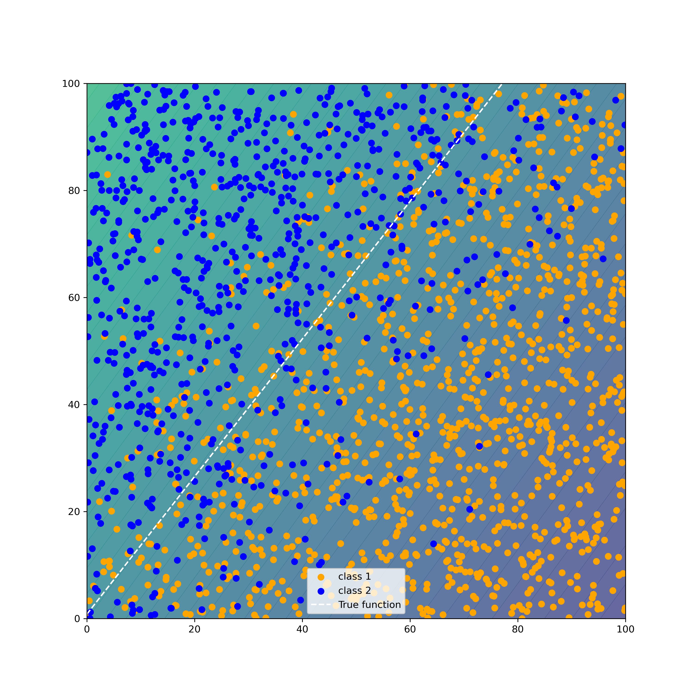

# Gaussian Process Hyperparameter Optmization
For this task, I wanted to implement a simple Gaussian process that optimizes two features on a logistic regression 
model. To test this, we need the following:

1. A random generative function to get an arbitrary function f(x) = Mx + b
2. A random generative function to generate noise
3. A random generative function to generate data that also provides predictive power to determine f(x)
4. A logistic regression model
5. A gaussian process with a RBF (radial basis function or a Gaussian) kernel
6. A bayesian optimization loop that determines the distribution of performance for a set of hyperparameters H

Using this process, we can tune our hyperparameters to our model and provide a tuned logistic regression predictor. 

